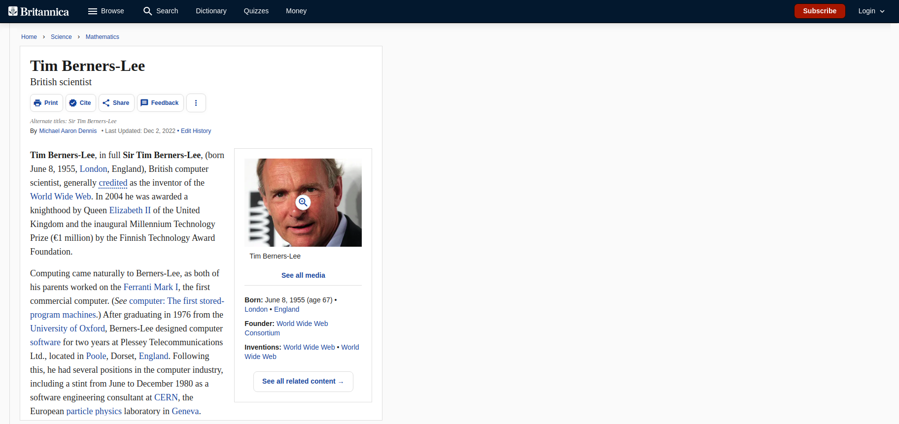
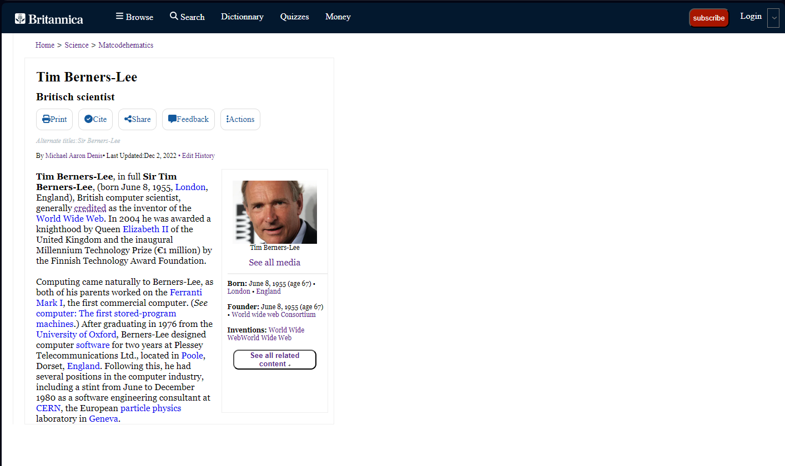

# ATTENTION this is the 1.0 version, 2.0 there [Tim Berners-Lee 2.0](https://github.com/anthosaxe/Tim-Berners-Lee-2.0/tree/main)

# This repository contains a reprodution of a web page about Tim Berners Lee :

# And the page have to be responsive :
 

# Reproduction :
[Tim-Berners-Lee](https://anthosaxe.github.io/Tim-Berners-Lee/) 
 

## futur improvement
1. few problems with responsive due to a bad management with the flexbox concept. have to make a "plan" of section/article before coding to manage it beter.
2. bad use of id/class, seen when starting with responsive.
3. beter start with mobile next time.
4. too much css line, lots of repeat.
